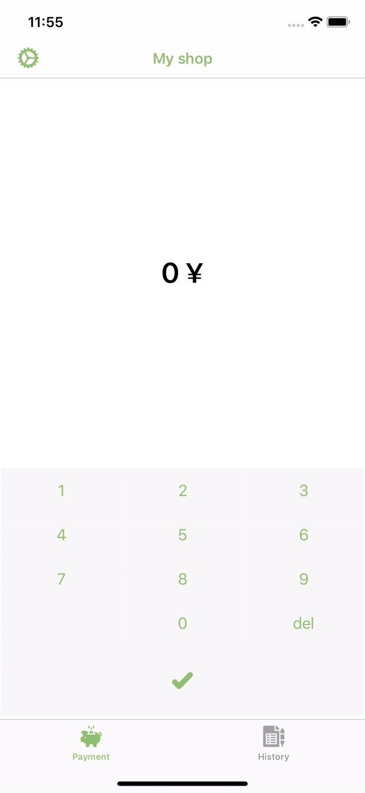

# Merchant App iOS :snake: (Built with VIPER)

 
 
 
 

## Demo

## Authors & Maintainers
- Jean-Baptiste Dominguez [[Github](https://github.com/jbdtky), [Twitter](https://twitter.com/jbdtky)]

## References
- [BitcoinKit](https://github.com/Bitcoin-com/BitcoinKit)

## License

Merchant App is available under the MIT license. See the LICENSE file for more info.
